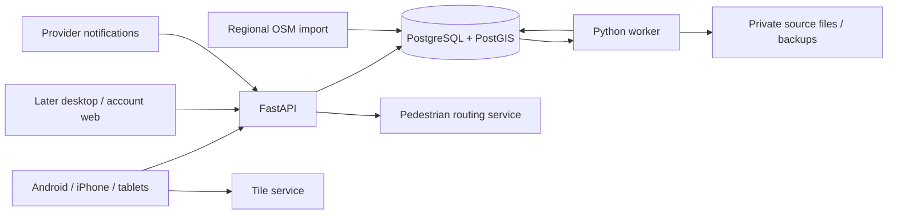

# City Runner: from spike to product

5 October 2026. Research and implementation plan; only the explicitly recorded foundations are delivered. [PROJECT.md](PROJECT.md) owns requirements; [BACKLOG.md](BACKLOG.md) owns status; [DEV_PLAN.md](DEV_PLAN.md) defines executable milestones, dependencies and subagent briefs against merged main `f3e67ba`. Public competitor pages establish advertised behaviour, not their internal architecture. No CityStrides database or source access is assumed.

## Product decision

Build the street-exploration loop first: import history → understand coverage → find missing streets → plan a route → run with an existing tracker → automatically update progress. Android/iPhone are primary; tablets accompany them; desktop packages follow. Keep planning, coverage and missing-node views free initially. The 14-day trial applies only to future premium features.

The spike demonstrates one real GPX upload and partial coverage. It does not demonstrate production provider sync, multi-user isolation, history-scale performance, or store-ready apps. Continue independent product work while provider feasibility is investigated; mandatory Garmin/Strava support remains a public-launch gate.

Implement comparable user capabilities with our own code and interface. Start with a supported regional dataset, not a worldwide coverage promise. A complete regional dataset and local city lookup are necessary before we can evaluate full-run accuracy reliably.

## Feature comparison and release scope

CityStrides currently advertises lifetime maps, street search, city progress and competition. Its pricing page lists free unlimited activities/cities and a lifetime map; supporter features include advanced maps, missing-node discovery, route building, challenges, replay and faster processing. Listed recurring pricing is $5/month or $50/year, with EUR prices shown as €4/month or €43/year. These are today's advertised prices, not our target cost. [Homepage](https://citystrides.com/), [pricing](https://citystrides.com/pricing).

| Capability | Current spike | Our release decision | Demonstration required |
| --- | --- | --- | --- |
| Connect tracker and import history | Manual real GPX; unofficial Garmin connector tested with fixtures | Mandatory approved Garmin and Strava adapters | Real OAuth connection, available-history comparison, new activity, restart, reconnect |
| Lifetime GPS map | Basic tracks and city buttons | Free core | Multiple cities, date/type/source filters, viewport queries, readable large history |
| City progress | Cached Gent + synthetic cities | Free core | Search cities, sort progress, incomplete/partial/completed street lists |
| Street/node inspection | Street popup; visited/missing points | Free core | Tap street, inspect remaining nodes and contributing activities, missing-only overlay |
| Activity history | PoC browser explorer and backend owner-scoped list/detail; mobile fixtures | Connect production ingestion and clients | Paginated list, activity map, import/source state and new coverage attributed to activity |
| Completion overrides | Missing | Free core | Mark inaccessible street manually, reason, undo, distinguish manual and GPS completion |
| Route builder | Missing | Free public beta requirement | Walking/running routing, waypoint edit/undo, distance, save/reopen, GPX export |
| Current position | Missing | Free mobile core | Foreground location over missing nodes with denied-permission handling |
| Automatic updates | Experimental five-minute Garmin polling | Mandatory provider events + reconciliation | New events overtake backfill; edits/deletions update contributions; clients refresh |
| Phone/tablet applications | Expo/MapLibre fixture shell; native execution unverified | Android/iPhone/iPad/Android tablet beta | Physical-device login, map, import, planner, resume and network recovery |
| Desktop applications | Missing | Following required stage | Windows/macOS/Linux install, account, planning, import/export and updates |
| Support → verified fix | Missing | Reports in beta; agent automation after preview infrastructure | Report, reproducible defect, preview, user verification, CI, merge, release status |
| Challenges/leaderboards/badges | Missing | Later parity, subject to data-source permission | Separate specification before development; private tracks remain private |
| Replay/weather/posters/referrals | Missing | Later, demand driven | Not required to validate the core exploration loop |
| Exact visited road intervals | Missing; nodes are approximate | Later investigation | Do not label a node score as exact street-length coverage |

The reference completion rule uses existing OSM nodes, a 25 m GPS-sample tolerance and 90% street completion, requiring every node for streets with fewer than ten. A manual-complete action exists for inaccessible streets. Our initial rules follow that documented behaviour; production eligibility/grouping will be explicit and versioned. [CityStrides data explanation](https://community.citystrides.com/t/about-the-node-street-and-city-data/19802).

## Data access is a product dependency

| Source | What we need | Known constraint / decision |
| --- | --- | --- |
| OSM | Public boundaries, named pedestrian-accessible ways, original nodes and update versions | Import a regional extract, share geography across users, identify cities locally. Public Overpass is useful for experiments, not a critical request-time dependency. |
| User files | GPX/FIT history, original timestamps and source provenance | Validate and retain only permitted data. An exported Strava file is still Strava-origin data; do not treat it as an unrestricted AI fixture. |
| Strava | Authorized activity history/streams, OAuth, create/update/delete events | Seven-day cache and persistent-index restrictions affect lifetime progress; broad AI restrictions affect support-agent inputs. Obtain written clarification/permission for the exact design before production. |
| Garmin | Activity GPS/files, OAuth, notifications, actual backfill availability | Business approval and evaluation access required. Verify oldest accessible activity and file/history limits on a real account. Personal-password scraping is not the production adapter. |
| Apple Health | User-authorized workout routes | Route samples arrive late and can change; support anchored updates and absent routes. Test actual device availability. |
| Health Connect | User-authorized workout routes | Other apps' routes cannot be read in the background. Provide deliberate foreground import and use approved cloud adapters for server-side automatic sync. |
| Other providers | COROS/Polar/Suunto/Wahoo candidates | Record demand and verify developer access before promising adapters. |
| Tiles and routing | Basemap styles/tiles and pedestrian route geometry | Separate service contracts, quotas, cost and offline permission; OSM geography being open does not make all hosting services unlimited. |

Strava's policy also restricts derived/anonymized data and persistent retrieval stores, and prohibits Strava data in AI context/evaluation outside specified exceptions. **Our conclusion is that ordinary OAuth access alone does not establish permission for this permanent-progress and agent-support design.** Keep provider-derived data out of agent fixtures and prompts; user consent alone does not override provider restrictions. [Strava policy §§5.3–5.5, 6.2](https://www.strava.com/legal/api_policy).

Strava supports activity/revocation webhooks, but events are notifications requiring subsequent fetches. Its current getting-started guide describes owner-only initial access, a developer subscription prerequisite, dashboard upgrade to ten athletes and further review. Use actual dashboard quotas rather than fixed assumed throughput. [Webhooks](https://developers.strava.com/docs/webhooks/), [access](https://developers.strava.com/docs/getting-started/).

Garmin documents OAuth 2.0 business access, approval before evaluation, activity files, notification options and backfill tooling. Public documentation does not establish that our application will be accepted or that all historical activities are accessible. [Program FAQ](https://developer.garmin.com/gc-developer-program/program-faq/), [Activity API](https://developer.garmin.com/gc-developer-program/activity-api/).

Device behaviour is documented by [Apple](https://developer.apple.com/documentation/healthkit/reading-route-data) and [Android](https://developer.android.com/health-and-fitness/health-connect/features/exercise-routes). Public [Overpass guidance](https://wiki.openstreetmap.org/wiki/Overpass_API#Public_Overpass_API_instances) describes overloaded small-project services; [OSMF tile policy](https://operations.osmfoundation.org/policies/tiles/) prohibits bulk/offline downloads from its standard tile endpoint. That tile policy does not automatically apply to our spike's OpenFreeMap service; evaluate the selected vendor's own terms.

Public data access is not access to everybody's workouts. First-release measurements are the user's own activity counts, distance/time where available, visited nodes, completed streets, progress by period, import delays and coverage changes. Cross-user analytics, social comparison and AI use need source-specific permission before implementation.

## Architecture recommendation

Keep Python/FastAPI for API and workers to reuse the spike's domain code and tests. This revises the earlier proposed TypeScript backend. FastAPI/PostGIS activities, server authentication, migrations and the durable worker queue are implemented; geography, coverage and ingestion remain unfinished. Keep client TypeScript in React Native and the later React/Tauri desktop interface. Share generated API contracts and client logic; keep completion rules on the server.



One Lightsail production VM, Terraform, Caddy for HTTPS, systemd services for API/worker/PostgreSQL, and private S3 files/backups. No Lambda, Kubernetes or Docker requirement. A worker is a separate process using the same codebase, not a separate distributed service. Use PostgreSQL durable jobs with leases/retries; do not add Redis initially. Choose instance size after measuring regional geography plus backfill memory/CPU, not from the single-run demo.

Do not expose production while it still uses one Basic-auth identity. Add verified Google/Apple identities, per-user sessions and ownership checks before any shared remote beta. Maintain one account across login identities and workout providers. Provider secrets stay server-side; platform sessions use secure credential storage.

Proposed modules: accounts, sources/imports, geography, coverage, routes, support, billing. Keep one backend package and ordinary module boundaries. Extract a service only when a measured isolation or scaling need justifies it.

### Storage and processing

| Shared once per map version | Per user / permitted source | Operational |
| --- | --- | --- |
| Cities, ways, existing nodes, street-node membership, eligibility rules | Accounts, source connections, activities/source contributions, node hits, summaries, overrides, saved routes | Durable jobs, sync cursors, reports/fix attempts, releases, entitlements |

Shared geography avoids copying a city's nodes for every user. Store normalized tracks as compressed segmented blobs, not one SQL row per GPS point; preserve original timestamps and sample geometry for matching. Simplify only rendering data. Keep per-activity node contributions so deleting one run removes only its visits. Equivalent provider/file activities can share a canonical activity while retaining independent source provenance and deletion rules.

Pipeline: persist event/upload → enqueue → fetch/parse → normalize → deduplicate → indexed node matching → replace that source revision's contributions → update affected summaries → advance progress revision. Acknowledge webhooks quickly; jobs survive restarts, deduplicate retries, lease abandoned work and cap retries. New events have priority over history. Out-of-order edits fetch the current source state; deletion cancels stale work. No invented GPS segments between gaps.

Regional OSM import happens independently of private GPS tracks. Unsupported geography shows **coverage pending**, rather than zero progress. Version boundaries, eligibility and grouping; atomically activate a validated version and rebuild affected counts. Show why a map update changed the denominator. Keep the spike's city+name grouping as an explicit first policy, with a known limitation for disconnected same-name streets; do not claim it solves street identity universally.

Map APIs query indexed viewport geometry and a user's matching contributions. The current spike scans all streets/tracks and derives counts on each map refresh; that must change before history-scale testing. Start with bounded GeoJSON and zoom-based simplification; add private vector tiles if benchmarked payload/latency requires them. Date-filtered tracks must have separately labelled period coverage, rather than silently changing lifetime totals.

### First application screens and API contracts

| Screen | User action | Minimum backend contract |
| --- | --- | --- |
| Explore | View history, missing streets/nodes, current position | Bounded map query, progress revision, layer filters |
| Cities / city detail | Search/sort cities; inspect streets by completion | Paginated cities/streets; stable IDs and dataset version |
| Street detail | Inspect visited/remaining nodes and contributing runs; override/undo | Street nodes, contributions, separate manual status |
| Activities / detail | Filter runs; show one track, new coverage, failed processing | Paginated activity metadata, individual geometry and import state |
| Routes | Plan, edit, save, reopen, export | Pedestrian route request, saved route CRUD, GPX export |
| Connections | Connect/reconnect provider; inspect history/sync; upload files | OAuth callbacks, source status, paginated jobs, retry |
| Account / support | Privacy, export/delete, submit/track reports | Verified sessions, account operations, private report lifecycle |

Introduce only contracts needed by each slice; no speculative generic provider or plugin framework. OpenAPI-generated client types bridge Python and TypeScript.

## Built-in report → agent → preview → merge

Proposed product flow:

```text
/support/reportIssue
  → private report + triage
  → agent reproduces defect in isolated checkout
  → regression test + candidate fix + pull request
  → CI + isolated preview for that revision
  → reporter verifies “fixed” or “still broken”
  → trusted merge gate checks revision, scope and tests
  → automatic merge → deployment/build → reporter sees release status
```

GitHub hosts the repository and backend/mobile CI. Keep product reports in our database and optionally mirror sanitized engineering issues later. Users should not need GitHub or Jira to report a problem or verify a fix. Previews and agent-driven merge orchestration remain implementation work.

### Report contract

Collect title, expected/actual behaviour, steps, category and app/build version. Include screen, anonymized correlation ID and error code automatically; show attachments/diagnostics before sending. Report types: import failure, missing coverage, map-data problem, planner/UI bug, account/payment problem, feature request.

Keep reports and attachments private and owner-scoped. Screenshots can contain tracks; make attachment transfer an explicit choice. Do not automatically attach GPX, tokens, raw provider responses or personal logs. Do not automatically publish user submissions as public GitHub issues.

Triage distinguishes code defects from provider outages, revoked consent, unsupported geography, inaccessible streets and feature requests. A map-data issue may need a local eligibility correction or OSM contribution guidance; a provider outage usually needs retry/status rather than a patch. Auto-fix eligibility is a trusted policy decision; the report text cannot grant permissions.

### Agent execution and usable previews

Run agents on disposable isolated compute with a bounded attempt/time/token budget, one active attempt per report and cancellation/retry states. Use repository code, public OSM fixtures, synthetic tracks and permitted diagnostics. A trusted step may transform a private reproduction into a synthetic test without giving raw provider data to the agent. If no permissible reproduction is available, the report waits for a maintainer.

The code-writing worker cannot read production storage/secrets, deploy, set its own successful merge gates, or merge. The trusted controller owns those actions. User reports, attachments and candidate code are untrusted inputs; do not execute branch code with privileged CI secrets. [GitHub's guidance](https://docs.github.com/en/actions/reference/security/securely-using-pull_request_target) explains that failure mode.

Use a separate temporary preview VM/database with synthetic or specifically permitted test data, test sessions and stubbed provider events. No production database or OAuth token sharing. Start with one active preview and an expiry to control cost. Agent/preview compute is additional to the one production application VM; arbitrary generated code cannot safely run on that production host.

Browser previews verify shared web/backend behaviour. For native UI, sensors, file pickers or health integration bugs, provide an actual Android/iOS beta build through the chosen distribution channel. A browser preview cannot establish that a native defect is fixed. An existing beta app can select an isolated preview backend for backend-only fixes; this environment selection is tester-only and never redirects ordinary production sessions.

Associate preview URL/build, artifact digest, fixture/data version, candidate commit and reporter verdict. Later commits invalidate reporter approval and prior test/preview evidence. Record **still broken**, **cannot reproduce**, **waiting for data**, **expired** and **needs maintainer**; inactivity never counts as approval.

### Automatic merge contract

For eligible ordinary UI/read-only code fixes, merge automatically only after an issue-specific regression passes, required unaffected behaviour passes, trusted scope checks pass and the reporter confirms the exact preview revision. Required checks come from protected configuration the candidate cannot modify. Run the applicable baseline tests as well as the new regression; weakening/removing baseline checks requires maintainer review. Rebase/update against current main reruns relevant checks and requires renewed user verification if the preview revision changes. Independent concurrent fixes must be checked against the actual merge base/result.

Authentication, authorization, billing, secrets, data deletion, schema migrations, provider-policy changes and changes to CI/merge permissions require maintainer review before automatic landing. This still allows automatic merging after that required review. A user's functional confirmation is insufficient to validate those system-wide effects.

[GitHub auto-merge](https://docs.github.com/en/pull-requests/how-tos/merge-and-close-pull-requests/automatically-merging-a-pull-request) can wait for required checks/reviews; implement reporter verification as a trusted required check tied to the candidate SHA. The code agent cannot impersonate the reporter or issue that check.

Merging is not delivery. Keep distinct statuses for merged, deployed, available in native beta/store, user verified and reopened. Deploy server fixes with smoke checks and rollback; native releases need signing and distribution/review. Do not tell users a store fix is available immediately after its branch merges.

## Build order and proof

| Stage | Build | Exit evidence |
| --- | --- | --- |
| A: provider feasibility + useful explorer | Clarify mandatory access; activity list/detail, city/street search, missing-only map layers, visible import state and local regional geography | Real permitted files across cities, explainable contribution counts, reload/restart, no private point queries for discovery |
| B: production foundation | Repository/CI, FastAPI/PostGIS migration, durable jobs, identity/session ownership, backups | Two users cannot see/change each other's data; interrupted processing resumes; restore tested |
| C: phone/tablet progress beta | Android/iPhone clients, tablet layouts, approved cloud connections, device health import | Real device → provider → backend → both apps; historical limits and latency measured |
| D: free exploration beta | Free planner/export/current location, overrides, report page, measured map performance | Plan/run/import/inspect/adjust loop on both phones and tablets |
| E: support automation | Trusted preview builds and verification first, then bounded code agent and merge controller | One ordinary seeded defect goes from report to verified deployed fix; changed revision/failed test prevents merge |
| F: remaining distribution/monetization | Desktop packages, defined premium features, 14-day trial, payment compliance | OS installation/update evidence; payment/trial expiry preserves free features |

Stages are sequencing guidance, not a demand to finish every provider approval before useful explorer work. Keep existing real Garmin acceptance as an outstanding integration investigation, not a reason to stop unrelated development. Build reporting before adding an agent; build previews and trusted checks before enabling automatic merge.

GPX date/type and original point timestamps are retained; invalid/missing metadata is unknown, and legacy rows remain compatible. The PoC activity explorer/selected-activity UI and street-category/missing-node filters are implemented. The production activity API, fixture mobile shell and Terraform templates are merged. Next work: reproducible PostGIS/CI and native builds, reviewed identity/source contracts, then production import/jobs/geography/coverage wired to actual mobile accounts. [DEV_PLAN.md](DEV_PLAN.md) supplies that order and small task briefs. Distance and chronological new-coverage attribution remain unimplemented; define the timestamp tie-break before displaying gains. Keep the working upload and real-run map as the comparison baseline.

## Risks, costs and decision gates

| Risk | Failure we must avoid | Concrete response |
| --- | --- | --- |
| Provider access/retention | Core mandatory import works in tests but cannot be offered legally/reliably | Written use/storage outcome plus real approved adapter test; reconsider viability if mandatory access is unavailable |
| Node approximation | Adjacent-road false visits, sparse sample misses, inaccessible nodes | Explain 25 m rule, provenance and overrides; no precise-length claim; fixtures for parallel streets/gaps/borders |
| OSM changes | City's percentage drops with no explanation | Versioned datasets, replace stale membership, rebuild, report changed denominator |
| Large histories | Full scans/huge map payloads make the phone unusable | Indexed viewport queries, compressed tracks, summaries, measured workloads before global rollout |
| Imported duplicates/deletions | Garmin+Strava double count or disconnect leaves prohibited data | Source contributions, exact IDs/hashes, tested matching and source-specific deletion |
| Generated fixes | Incorrect fix passes narrow tests or gains production access | Independent trusted gates, isolated previews/compute, reporter revision verification, restricted automatic scope |
| Automation cost/abuse | Every report launches an expensive endless agent | Per-account quotas, duplicate triage, bounded attempts, one active preview, expiry and maintainer fallback |
| Native preview/release delay | User verifies web behaviour but phone remains broken | Device beta artifacts, exact build IDs, distinct merge and availability status |
| Price sustainability | Cheap subscription cannot pay for imports/maps/support fixes | Measure storage, CPU, tiles, routing, backups and agent runs; do not promise a final price before beta measurements |

Initial measurements: active users, activities/source, samples/activity, geography/node counts, compressed bytes/activity, activity-node contributions, queue delay, processing p50/p95, map payload/latency, API calls/source, preview lifetime and agent cost/resolved issue. Operational measurements need no raw private tracks in telemetry. Avoid provider-data product analytics where prohibited.

Use `monthly cost = application VM + files/backups/egress + tiles + routing + CI/previews + agent attempts + payment/store overhead`. Cost per user includes unsuccessful fix attempts and free accounts, not just successful paid users. The earlier €30/year or €3/month price remains a proposal; paid features, trial start and store-payment approach still need decisions. Free planner/core coverage is retained.

No Jira requirement: the stable CR/T IDs, evidence links and these docs suffice now. Choose license, initial supported geography, tile/routing vendors and supported OS versions before public application distribution. Provider applications, external messages, cloud provisioning and auto-merge activation remain future implementation actions. Repository initialization/publication is separate from application deployment.
